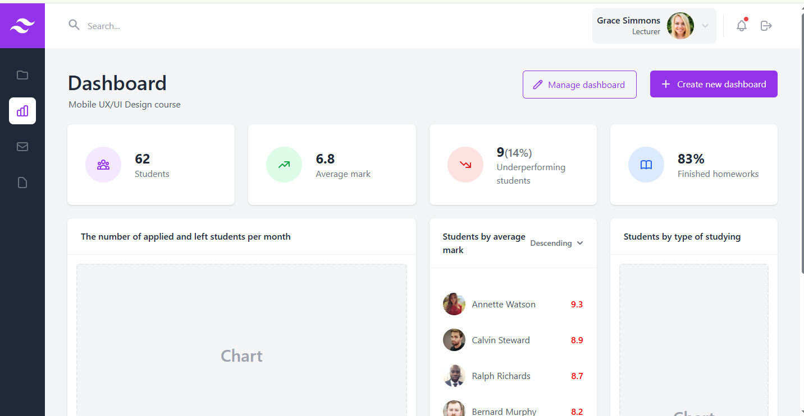
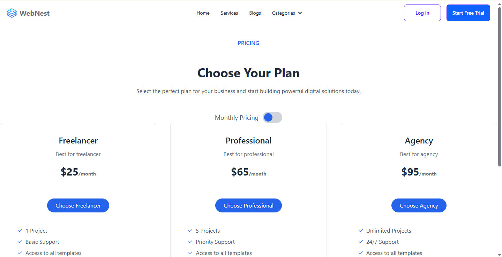
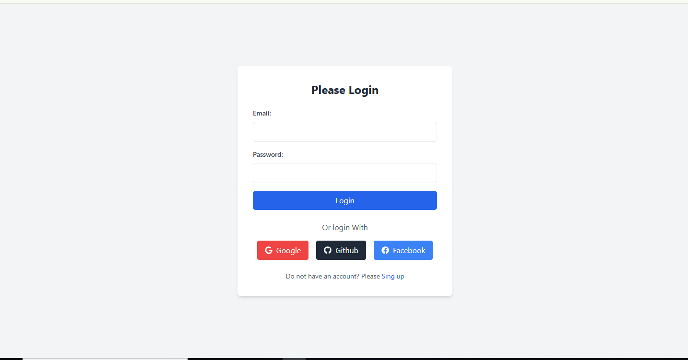
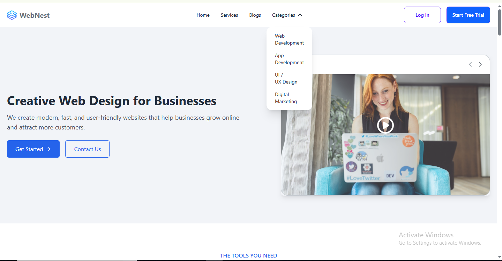

# 🌐 Webcode-Agency-Website


A modern, responsive **agency website** built with **HTML, CSS, JavaScript, React, Vite, Tailwind CSS, Firebase, and Figma**, ideal for showcasing services, portfolios, or personal projects.

---

## 🌐 Live Demo

[View Live Website](https://webcode-agency-website-4t42-g48z16xo3.vercel.app/)  


---

## 📌 About This Project

This project is designed to demonstrate full development and design workflow from **A to Z**:

- Multi-page responsive layout  
- Interactive components using JavaScript & React  
- Tailwind CSS for styling & responsive design  
- Firebase for hosting, authentication, and database  
- UI/UX design using **Figma**  
- ESLint for clean code and quality control  

---

## 📌 Features

- Fully responsive layout  
- Smooth navigation with React Router  
- Interactive and dynamic components  
- Firebase authentication & database integration  
- Clean and modern UI design  
- Tailwind CSS for responsive design  
- Designed with Figma prototypes  
- ESLint ensures code quality  

---

## 📌 Tech & Design Skills (A to Z)

- **CSS3 & Tailwind CSS** – Styling & layout  
- **ESLint** – Code quality  
- **Firebase** – Hosting, Auth, Database  
- **Figma** – UI/UX design and prototyping  
- **HTML5** – Website structure  
- **JavaScript (ES6+)** – Interactivity & dynamic components  
- **React** – Frontend framework  
- **Vite** – Fast development & build tool  

---


## 📌 Screenshots

  
  
  
  


---

## ⚡ Installation

1. Clone the repository:

```bash
git clone https://github.com/md-rubel-ahmed/Webcode-Agency-Website.git
cd Webcode-Agency-Website

## 👤 Author

**md-rubel-ahmed**

- GitHub: [md-rubel-ahmed](https://github.com/md-rubel-ahmed)
